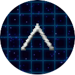

<center>
    
    <h2><b>RPPHS</b></h2>
    <h4>PS Vita Twin-Stick Shooter</h4>
    <hr>
    <p>
        <a href="#screenshots">Screenshots</a> &bull; 
        <a href="#description">Description</a> &bull; 
        <a href="#installation">Installation</a> &bull;
        <a href="#building">Building</a> &bull;
        <a href="#theme-tutorial">Theme Tutorial</a> &bull;
        <a href="#credits">Credits</a>
    </p>
</center>


## Screenshots
<center>
    
    
    
    
</center>

## Description
Blast your way through those shapes in this Geometry Wars-inspired twin stick shooter for the PlayStation Vita! Enter your initials for the offline leaderboards, customize your crosshair, and mess with our super-cool settings menu.. or don't, that's entirely up to you.

## Installation
<a href="https://github.com/G333333/RPPHS/releases/download/v1.0/RPPHS.vpk">Get the latest version here</a> and install using VitaShell. If you would like to test the latest latest changes see the build instructions below. 

## Building
- Clone or download the project
- Run the following from a terminal `cd build && cmake ../ && ./make.sh`
- The .VPK will be outputted to the RPPHS/build folder
- Install the .VPK with VitaShell

## Theme Tutorial
- Download the default theme zip file from [images/theme/default.zip](https://github.com/G333333/RPPHS/raw/master/images/theme/default.zip) and unzip it somewhere on your PC. This contains almost everything you'll need to create a custom theme.

- Rename the default folder to the name of your theme.

- Replace the images with images for your theme. (Images need to have the same names and dimensions as the ones being replaced)

- Edit the config.txt file within your themes folder. 

The config.txt file contains the colors for in-game objects. It is formatted like so:
```
mainTextColor
{
  Red:255
  Green:0
  blue:0
}
```
The first line is the variable name and the lines inside the are the values that will be assigned to that variables color values. Your themes config.txt file MUST follow this format and copying the original version and only modifing the color values is strongly suggested.

- Compress your theme folder
- Transfer the zip file containing the theme to the vita and unzip the contents to `ux0:/data/RPPHS/theme/"Theme-name"/`
- Finally, edit the file located at `ux0:/data/RPPHS/themes.txt` and add the name of your theme to the bottom of the file.

## Credits
* G33: Programming, Design
* MotoLegacy: Live Area, Player/Enemies, Programming, Design

### Special Thanks to:
* Xerpi: libVita2D
* Xyz: SoLoud Vita Port
* Rinnegatamante: FPS Counter Code
* VitaSDK Contributors
* Ivan voiro @ OpenGameArt: Background Grid
* yd @ OpenGameArt: Menu Music
* Trevor Lentz @ OpenGameArt: Game Music
